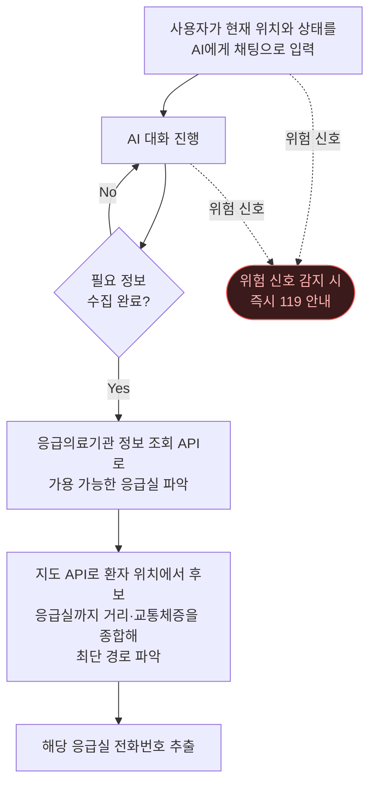

# 골든매치 (GoldenMatch)

보호자가 직접 환자를 이송할 때, AI가 지금 갈 수 있는 응급실을 매칭해주는 서비스.

🔗 https://golden-match.vercel.app/

## 동작 흐름

위험 신호: 의식없음 / 호흡이상 / 대량출혈 / 경련 / 외상 / 영유아 의식저하 / 임신후기 출혈.

## 사용한 API

| API | 용도 |
|---|---|
| **Groq Chat Completions** (`openai/gpt-oss-20b`) | AI 문진 대화, tool calling 으로 정보 수집 완료/119 강제 분기 판단 |
| **공공데이터 응급의료정보 (NEMC)** | 응급실 목록·가용 병상·중증 수용 가능 여부 조회 (`B552657/ErmctInfoInqireService` 3개 op `hpid` left-join) |
| **Kakao Local** | 사용자 입력 위치(주소·키워드)를 좌표로 변환 |
| **Kakao Mobility Directions** | 환자 위치 → 후보 응급실 ETA·최단 경로 계산 |
| **Kakao Map 딥링크** | 결과 카드에서 카카오맵 길찾기로 핸드오프 |

## 기술 스택

- Frontend: Vite + React 18 + TypeScript + Tailwind
- Backend: Hono on Vercel Functions (Node.js)
- 배포: Vercel
