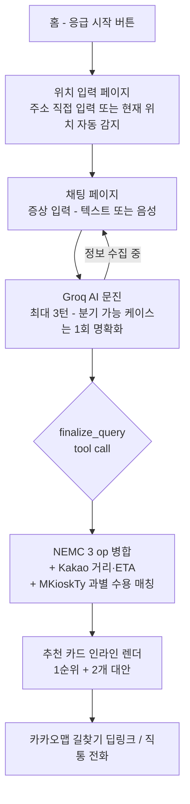

# 골든매치 (GoldenMatch)

보호자가 직접 환자를 이송할 때, AI가 지금 갈 수 있는 응급실을 매칭해주는 서비스.

🔗 https://golden-match.vercel.app/

## 사용자 흐름



## 시스템 아키텍처

```mermaid
flowchart LR
    subgraph Client [Web - Vite + React 18 - mobile-only]
        UI[ChatStream / ResultCard]
        SR[Web Speech API - 한국어 음성]
    end

    subgraph Edge [Vercel Functions - Hono]
        CHAT[/api/chat<br/>SSE stream]
        MATCH[/api/match<br/>응급실 매칭]
        GEO[/api/geo/reverse<br/>좌표→주소]
    end

    subgraph External [외부 API]
        GROQ[Groq<br/>openai/gpt-oss-20b]
        NEMC[공공데이터 NEMC<br/>응급의료정보]
        KAKAO[Kakao Local / Mobility]
    end

    UI -->|fetch SSE| CHAT
    UI -->|fetch JSON| MATCH
    UI -->|fetch JSON| GEO
    SR -. transcript .-> UI

    CHAT -->|tool calling<br/>finalize_query| GROQ
    MATCH -->|3 ops left-join| NEMC
    MATCH -->|좌표 변환 + ETA| KAKAO
    GEO --> KAKAO
```

## 매칭 알고리즘

1. **위치 해석**: Kakao Local로 주소→좌표 변환 (실패 시 시·도/시·군·구 토큰 fallback)
2. **NEMC 3 op 병렬 조회 후 `hpid` left-join**
   - `getEgytListInfoInqire` — 응급의료기관 기본정보
   - `getEmrrmRltmUsefulSckbdInfoInqire` — 실시간 가용 병상 (`hvec` = 응급실 일반)
   - `getSrsillDissAceptncPosblInfoInqire` — 중증질환 28개 카테고리 수용 가능 여부 (`MKioskTy1~28`)
3. **과별 매핑**: 사용자 증상 → `suspected_dept` → `MKioskTy*` 코드 집합 (NEMC 공식 스펙 v5.0 p.21-23 기준)
4. **랭킹** (`api/_lib/scoring.ts`)
   - **Hard split**: 과별 수용가능(`dept_severe_available = true`)인 병원만 primary 풀로 분리 → 불가 병원은 fallback
   - 가중치: `W_DEPT_SEVERE = 5`(과별 실수용) ≫ `W_AVAIL = 2`(병상수) > `W_DEPT_NAME = 0.5`(병원명 휴리스틱) > `W_ACCEPT_ANY = 0.3`(어떤 MKioskTy든 Y) - `W_ETA = 0.2`(분 단위 패널티)
5. **상위 1 + 2개 대안 반환** → 클라이언트가 채팅 스트림 안에 카드로 렌더, 컴포저는 결과 도착 시 잠김

## 사용한 API

| API | 용도 |
|---|---|
| **Groq Chat Completions** (`openai/gpt-oss-20b`) | **압도적인 TPS** — 응급 상황에서 1~2초 안에 문진 응답이 스트리밍됨. tool calling으로 `finalize_query(location_text, suspected_dept, severity_hints)` 호출 시점 판단 |
| **공공데이터 응급의료정보 (NEMC)** | 응급실 목록·실시간 가용 병상·중증질환 28개 카테고리 수용 가능 (`B552657/ErmctInfoInqireService` 3개 op `hpid` left-join) |
| **Kakao Local** | 사용자 입력 위치(주소·키워드)를 좌표로 변환 |
| **Kakao Mobility Directions** | 환자 위치 → 후보 응급실 ETA·최단 경로 계산 |
| **Kakao Map 딥링크** | 결과 카드에서 카카오맵 길찾기로 핸드오프 |
| **Web Speech API** | 한국어(`ko-KR`) 연속 음성 입력 → 채팅 텍스트 |

## 기술 스택

- **Frontend**: Vite + React 18 + TypeScript + Tailwind, react-router-dom, react-markdown(GFM), bootstrap-icons. 모바일 전용 폭(420px), iOS safe-area 대응
- **Backend**: Hono on Vercel Functions (Node.js, 로컬은 Bun으로 `api/dev.ts` 실행)
- **공유 스키마**: Zod (web/api 양쪽 `schema/` 미러)
- **배포**: Vercel

## 로컬 실행

```bash
pnpm install
pnpm dev                                              # web (Vite, http://localhost:5176)
bun --hot --env-file=.env.local api/dev.ts            # api (Hono, http://localhost:8787)
```

`.env.local`에 필요한 키:
- `GROQ_API_KEY`
- `DATA_GO_KR_SERVICE_KEY` (NEMC)
- `KAKAO_REST_API_KEY`

## License

© 2026 &lt;team name&gt;. All rights reserved.
Source is published for reference only. No use, copying, modification,
or redistribution is permitted without prior written consent.
